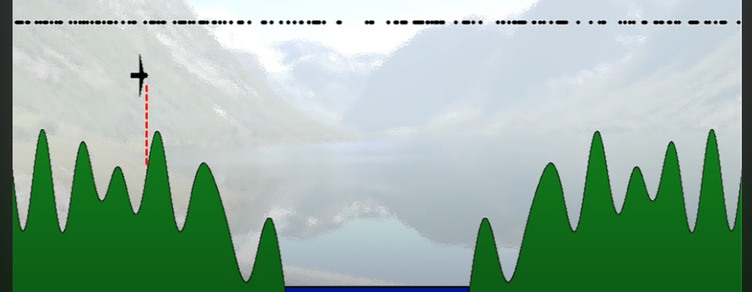

# 1D particle filter outline

## setting
I'm planning to replicate the example in the youtube video. The example is a plane flying above the mountian, location only contain x cordinate (it does not move up and down), the control (ut) is a horizontal velocity (eg. 3m/s), and the measurement is the distance from the ground (or the moutain). 

## process outline 
1. random sample on the whole map as initial particles 
2. apply filter
   1. compare each particle with the current measurement 
   2. if current particle looks like a good guess, increase its weight
   3. after process every particle, do a resampling 
   4. take the highly weight particles, and generate new samples around those particles
3. Advance time step, moving the plane and the particles by the control (3m/s)
4. repeat 2 and 3 until find good estimation

### sampling
really simple sampling:
  1. calculate the total weight and normalize it from 0 to 1
  2. sample the 1/M (M is the number of particles you want to get)
  3. check which interval the point lies in 
low variance resampling