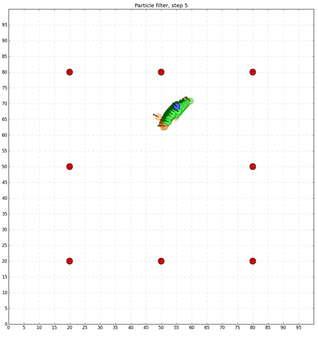

# 2D particle filter outline

## 2D case without orientation

### Setting:
This simulation is inspried by this [tutorial](https://salzi.blog/2015/05/25/particle-filters-with-python/). A Robot is in a 2D map with some obstacle in it, the robot knows its distance to every obstacles, and the aim is to locolize the robot in the map. In this setting, we are not considring the orientation of the robot, instead we are assuming the robot has Omiwheels

### Method / process outline 
1. random sample on the whole map as initial particles 
2. apply filter
   1. compare each particle with the current measurement 
   2. if current particle looks like a good guess, increase its weight
   3. after process every particle, do a resampling 
   4. take the highly weight particles, and generate new samples around those particles
3. Advance time step, moving the plane and the particles by the control (3m/s)
4. repeat 2 and 3 until find good estimation